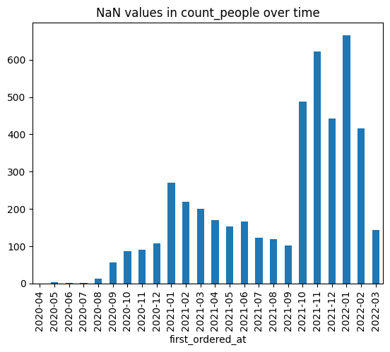
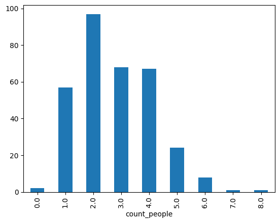
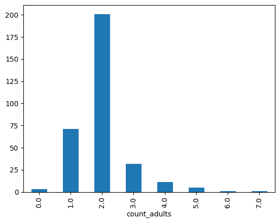
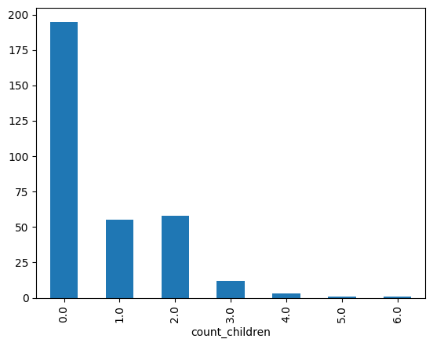
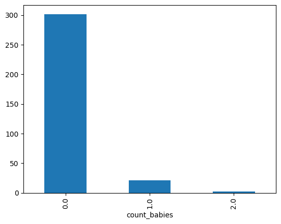
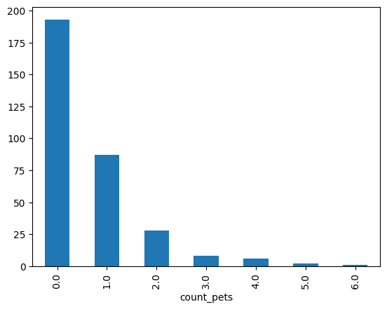

```python
import pandas as pd

abandonded_carts = pd.read_parquet("/home/manucorujo/zrive-data/abandoned_carts.parquet")
inventory = pd.read_parquet("/home/manucorujo/zrive-data/inventory.parquet")
orders = pd.read_parquet("/home/manucorujo/zrive-data/orders.parquet")
regulars = pd.read_parquet("/home/manucorujo/zrive-data/regulars.parquet")
users = pd.read_parquet("/home/manucorujo/zrive-data/users.parquet")

```

# Abandoned carts


```python
abandonded_carts.info()
```

    <class 'pandas.core.frame.DataFrame'>
    Index: 5457 entries, 0 to 70050
    Data columns (total 4 columns):
     #   Column      Non-Null Count  Dtype         
    ---  ------      --------------  -----         
     0   id          5457 non-null   int64         
     1   user_id     5457 non-null   object        
     2   created_at  5457 non-null   datetime64[us]
     3   variant_id  5457 non-null   object        
    dtypes: datetime64[us](1), int64(1), object(2)
    memory usage: 213.2+ KB


```python
abandonded_carts.head()
```


<div>
<style scoped>
    .dataframe tbody tr th:only-of-type {
        vertical-align: middle;
    }

    .dataframe tbody tr th {
        vertical-align: top;
    }

    .dataframe thead th {
        text-align: right;
    }
</style>
<table border="1" class="dataframe">
  <thead>
    <tr style="text-align: right;">
      <th></th>
      <th>id</th>
      <th>user_id</th>
      <th>created_at</th>
      <th>variant_id</th>
    </tr>
  </thead>
  <tbody>
    <tr>
      <th>0</th>
      <td>12858560217220</td>
      <td>5c4e5953f13ddc3bc9659a3453356155e5efe4739d7a2b...</td>
      <td>2020-05-20 13:53:24</td>
      <td>[33826459287684, 33826457616516, 3366719212762...</td>
    </tr>
    <tr>
      <th>13</th>
      <td>20352449839236</td>
      <td>9d6187545c005d39e44d0456d87790db18611d7c7379bd...</td>
      <td>2021-06-27 05:24:13</td>
      <td>[34415988179076, 34037940158596, 3450282236326...</td>
    </tr>
    <tr>
      <th>45</th>
      <td>20478401413252</td>
      <td>e83fb0273d70c37a2968fee107113698fd4f389c442c0b...</td>
      <td>2021-07-18 08:23:49</td>
      <td>[34543001337988, 34037939372164, 3411360609088...</td>
    </tr>
    <tr>
      <th>50</th>
      <td>20481783103620</td>
      <td>10c42e10e530284b7c7c50f3a23a98726d5747b8128084...</td>
      <td>2021-07-18 21:29:36</td>
      <td>[33667268116612, 34037940224132, 3443605520397...</td>
    </tr>
    <tr>
      <th>52</th>
      <td>20485321687172</td>
      <td>d9989439524b3f6fc4f41686d043f315fb408b954d6153...</td>
      <td>2021-07-19 12:17:05</td>
      <td>[33667268083844, 34284950454404, 33973246886020]</td>
    </tr>
  </tbody>
</table>
</div>


5457 entries and 5457 non-null count in every column. Variant_id is a list with the IDs of the products that were in the cart (not a descriptive name, imo)

# Inventory


```python
inventory.info()
```

    <class 'pandas.core.frame.DataFrame'>
    RangeIndex: 1733 entries, 0 to 1732
    Data columns (total 6 columns):
     #   Column            Non-Null Count  Dtype  
    ---  ------            --------------  -----  
     0   variant_id        1733 non-null   int64  
     1   price             1733 non-null   float64
     2   compare_at_price  1733 non-null   float64
     3   vendor            1733 non-null   object 
     4   product_type      1733 non-null   object 
     5   tags              1733 non-null   object 
    dtypes: float64(2), int64(1), object(3)
    memory usage: 81.4+ KB


```python
inventory.head()
```


<div>
<style scoped>
    .dataframe tbody tr th:only-of-type {
        vertical-align: middle;
    }

    .dataframe tbody tr th {
        vertical-align: top;
    }

    .dataframe thead th {
        text-align: right;
    }
</style>
<table border="1" class="dataframe">
  <thead>
    <tr style="text-align: right;">
      <th></th>
      <th>variant_id</th>
      <th>price</th>
      <th>compare_at_price</th>
      <th>vendor</th>
      <th>product_type</th>
      <th>tags</th>
    </tr>
  </thead>
  <tbody>
    <tr>
      <th>0</th>
      <td>39587297165444</td>
      <td>3.09</td>
      <td>3.15</td>
      <td>heinz</td>
      <td>condiments-dressings</td>
      <td>[table-sauces, vegan]</td>
    </tr>
    <tr>
      <th>1</th>
      <td>34370361229444</td>
      <td>4.99</td>
      <td>5.50</td>
      <td>whogivesacrap</td>
      <td>toilet-roll-kitchen-roll-tissue</td>
      <td>[b-corp, eco, toilet-rolls]</td>
    </tr>
    <tr>
      <th>2</th>
      <td>34284951863428</td>
      <td>3.69</td>
      <td>3.99</td>
      <td>plenty</td>
      <td>toilet-roll-kitchen-roll-tissue</td>
      <td>[kitchen-roll]</td>
    </tr>
    <tr>
      <th>3</th>
      <td>33667283583108</td>
      <td>1.79</td>
      <td>1.99</td>
      <td>thecheekypanda</td>
      <td>toilet-roll-kitchen-roll-tissue</td>
      <td>[b-corp, cruelty-free, eco, tissue, vegan]</td>
    </tr>
    <tr>
      <th>4</th>
      <td>33803537973380</td>
      <td>1.99</td>
      <td>2.09</td>
      <td>colgate</td>
      <td>dental</td>
      <td>[dental-accessories]</td>
    </tr>
  </tbody>
</table>
</div>


Again, there aren't nulls in any column. I don't know the difference between price and compare_at_price. Is it like discounts?

# Orders


```python
orders.info()
```

    <class 'pandas.core.frame.DataFrame'>
    Index: 8773 entries, 10 to 64538
    Data columns (total 6 columns):
     #   Column          Non-Null Count  Dtype         
    ---  ------          --------------  -----         
     0   id              8773 non-null   int64         
     1   user_id         8773 non-null   object        
     2   created_at      8773 non-null   datetime64[us]
     3   order_date      8773 non-null   datetime64[us]
     4   user_order_seq  8773 non-null   int64         
     5   ordered_items   8773 non-null   object        
    dtypes: datetime64[us](2), int64(2), object(2)
    memory usage: 479.8+ KB


```python
orders.head()
```


<div>
<style scoped>
    .dataframe tbody tr th:only-of-type {
        vertical-align: middle;
    }

    .dataframe tbody tr th {
        vertical-align: top;
    }

    .dataframe thead th {
        text-align: right;
    }
</style>
<table border="1" class="dataframe">
  <thead>
    <tr style="text-align: right;">
      <th></th>
      <th>id</th>
      <th>user_id</th>
      <th>created_at</th>
      <th>order_date</th>
      <th>user_order_seq</th>
      <th>ordered_items</th>
    </tr>
  </thead>
  <tbody>
    <tr>
      <th>10</th>
      <td>2204073066628</td>
      <td>62e271062eb827e411bd73941178d29b022f5f2de9d37f...</td>
      <td>2020-04-30 14:32:19</td>
      <td>2020-04-30</td>
      <td>1</td>
      <td>[33618849693828, 33618860179588, 3361887404045...</td>
    </tr>
    <tr>
      <th>20</th>
      <td>2204707520644</td>
      <td>bf591c887c46d5d3513142b6a855dd7ffb9cc00697f6f5...</td>
      <td>2020-04-30 17:39:00</td>
      <td>2020-04-30</td>
      <td>1</td>
      <td>[33618835243140, 33618835964036, 3361886244058...</td>
    </tr>
    <tr>
      <th>21</th>
      <td>2204838822020</td>
      <td>329f08c66abb51f8c0b8a9526670da2d94c0c6eef06700...</td>
      <td>2020-04-30 18:12:30</td>
      <td>2020-04-30</td>
      <td>1</td>
      <td>[33618891145348, 33618893570180, 3361889766618...</td>
    </tr>
    <tr>
      <th>34</th>
      <td>2208967852164</td>
      <td>f6451fce7b1c58d0effbe37fcb4e67b718193562766470...</td>
      <td>2020-05-01 19:44:11</td>
      <td>2020-05-01</td>
      <td>1</td>
      <td>[33618830196868, 33618846580868, 3361891234624...</td>
    </tr>
    <tr>
      <th>49</th>
      <td>2215889436804</td>
      <td>68e872ff888303bff58ec56a3a986f77ddebdbe5c279e7...</td>
      <td>2020-05-03 21:56:14</td>
      <td>2020-05-03</td>
      <td>1</td>
      <td>[33667166699652, 33667166699652, 3366717122163...</td>
    </tr>
  </tbody>
</table>
</div>


No nulls again. It is not clear to me what it means *user_order_seq*, I guess that is the index of the number of order of this user. I'll check it by ordering the dataframe by *user_id* and *user_order_seq*, and check if this column has value 1 for the first order of every user, and it sums 1 in every successive order.


```python
orders.sort_values(by=['user_id', 'user_order_seq'], ascending=False)
```


<div>
<style scoped>
    .dataframe tbody tr th:only-of-type {
        vertical-align: middle;
    }

    .dataframe tbody tr th {
        vertical-align: top;
    }

    .dataframe thead th {
        text-align: right;
    }
</style>
<table border="1" class="dataframe">
  <thead>
    <tr style="text-align: right;">
      <th></th>
      <th>id</th>
      <th>user_id</th>
      <th>created_at</th>
      <th>order_date</th>
      <th>user_order_seq</th>
      <th>ordered_items</th>
    </tr>
  </thead>
  <tbody>
    <tr>
      <th>59784</th>
      <td>3999961317508</td>
      <td>fffd9f989509e36d1fc3e3e53627d6341482f385052a03...</td>
      <td>2022-02-17 11:37:31</td>
      <td>2022-02-17</td>
      <td>9</td>
      <td>[34465293107332, 34465293336708, 3446529333670...</td>
    </tr>
    <tr>
      <th>56893</th>
      <td>3978608115844</td>
      <td>fffd9f989509e36d1fc3e3e53627d6341482f385052a03...</td>
      <td>2022-02-04 11:00:31</td>
      <td>2022-02-04</td>
      <td>8</td>
      <td>[34465293107332, 34465293336708, 3446529333670...</td>
    </tr>
    <tr>
      <th>52066</th>
      <td>3962156253316</td>
      <td>fffd9f989509e36d1fc3e3e53627d6341482f385052a03...</td>
      <td>2022-01-20 09:45:57</td>
      <td>2022-01-20</td>
      <td>7</td>
      <td>[34317850116228, 34465293107332, 3446529392653...</td>
    </tr>
    <tr>
      <th>47062</th>
      <td>3934888919172</td>
      <td>fffd9f989509e36d1fc3e3e53627d6341482f385052a03...</td>
      <td>2021-12-23 13:46:54</td>
      <td>2021-12-23</td>
      <td>6</td>
      <td>[34465293107332, 34465293336708, 3446529333670...</td>
    </tr>
    <tr>
      <th>43696</th>
      <td>3911467401348</td>
      <td>fffd9f989509e36d1fc3e3e53627d6341482f385052a03...</td>
      <td>2021-12-04 17:04:50</td>
      <td>2021-12-04</td>
      <td>5</td>
      <td>[33826432188548, 33826432548996, 3427657033331...</td>
    </tr>
    <tr>
      <th>...</th>
      <td>...</td>
      <td>...</td>
      <td>...</td>
      <td>...</td>
      <td>...</td>
      <td>...</td>
    </tr>
    <tr>
      <th>55006</th>
      <td>3967806046340</td>
      <td>002fda98daf90c44ceb8601c93f504108afc2d3cdd5d00...</td>
      <td>2022-01-25 22:26:10</td>
      <td>2022-01-25</td>
      <td>1</td>
      <td>[33667279126660, 33719430512772, 3380354072589...</td>
    </tr>
    <tr>
      <th>36586</th>
      <td>3869556736132</td>
      <td>002b3799fded362f631b8238fa2a477a7673e1181b2756...</td>
      <td>2021-11-03 23:58:01</td>
      <td>2021-11-03</td>
      <td>1</td>
      <td>[33667247243396, 33667247243396, 3382643277837...</td>
    </tr>
    <tr>
      <th>16945</th>
      <td>3695931261060</td>
      <td>002abde5718600d5d4cb567ff36deb2d6fb81460257769...</td>
      <td>2021-05-01 17:28:56</td>
      <td>2021-05-01</td>
      <td>1</td>
      <td>[33667268083844, 33667268083844, 3366726808384...</td>
    </tr>
    <tr>
      <th>14083</th>
      <td>3669216788612</td>
      <td>0011d59295eaf3ef5809aba64f2401f11e76f5bf602207...</td>
      <td>2021-04-02 12:17:57</td>
      <td>2021-04-02</td>
      <td>1</td>
      <td>[33667174498436, 33667206283396, 3366720726643...</td>
    </tr>
    <tr>
      <th>43334</th>
      <td>3909779062916</td>
      <td>0001d93f7e96bcb713aa8c5283258b5c3a80a7062fbcaf...</td>
      <td>2021-12-03 07:31:44</td>
      <td>2021-12-03</td>
      <td>1</td>
      <td>[33826432548996, 33826462367876, 3382646236787...</td>
    </tr>
  </tbody>
</table>
<p>8773 rows × 6 columns</p>
</div>


# Regulars


```python
regulars.info()
```

    <class 'pandas.core.frame.DataFrame'>
    Index: 18105 entries, 3 to 37720
    Data columns (total 3 columns):
     #   Column      Non-Null Count  Dtype         
    ---  ------      --------------  -----         
     0   user_id     18105 non-null  object        
     1   variant_id  18105 non-null  int64         
     2   created_at  18105 non-null  datetime64[us]
    dtypes: datetime64[us](1), int64(1), object(1)
    memory usage: 565.8+ KB


```python
regulars.head()
```


<div>
<style scoped>
    .dataframe tbody tr th:only-of-type {
        vertical-align: middle;
    }

    .dataframe tbody tr th {
        vertical-align: top;
    }

    .dataframe thead th {
        text-align: right;
    }
</style>
<table border="1" class="dataframe">
  <thead>
    <tr style="text-align: right;">
      <th></th>
      <th>user_id</th>
      <th>variant_id</th>
      <th>created_at</th>
    </tr>
  </thead>
  <tbody>
    <tr>
      <th>3</th>
      <td>68e872ff888303bff58ec56a3a986f77ddebdbe5c279e7...</td>
      <td>33618848088196</td>
      <td>2020-04-30 15:07:03</td>
    </tr>
    <tr>
      <th>11</th>
      <td>aed88fc0b004270a62ff1fe4b94141f6b1db1496dbb0c0...</td>
      <td>33667178659972</td>
      <td>2020-05-05 23:34:35</td>
    </tr>
    <tr>
      <th>18</th>
      <td>68e872ff888303bff58ec56a3a986f77ddebdbe5c279e7...</td>
      <td>33619009208452</td>
      <td>2020-04-30 15:07:03</td>
    </tr>
    <tr>
      <th>46</th>
      <td>aed88fc0b004270a62ff1fe4b94141f6b1db1496dbb0c0...</td>
      <td>33667305373828</td>
      <td>2020-05-05 23:34:35</td>
    </tr>
    <tr>
      <th>47</th>
      <td>4594e99557113d5a1c5b59bf31b8704aafe5c7bd180b32...</td>
      <td>33667247341700</td>
      <td>2020-05-06 14:42:11</td>
    </tr>
  </tbody>
</table>
</div>


# Users


```python
users.info()
```

    <class 'pandas.core.frame.DataFrame'>
    Index: 4983 entries, 2160 to 3360
    Data columns (total 10 columns):
     #   Column                 Non-Null Count  Dtype  
    ---  ------                 --------------  -----  
     0   user_id                4983 non-null   object 
     1   user_segment           4983 non-null   object 
     2   user_nuts1             4932 non-null   object 
     3   first_ordered_at       4983 non-null   object 
     4   customer_cohort_month  4983 non-null   object 
     5   count_people           325 non-null    float64
     6   count_adults           325 non-null    float64
     7   count_children         325 non-null    float64
     8   count_babies           325 non-null    float64
     9   count_pets             325 non-null    float64
    dtypes: float64(5), object(5)
    memory usage: 428.2+ KB


Nuts1 is a geocoding standard to refer to administrative divisions of countries for statistical purposes, so can be transformed into longitude and latitude (more infomative). In this df all the count columns (5-9) have a lot of null values. I'll try to explore how are they distributed.


```python
users.sort_values(by=["first_ordered_at"], ascending=False).head()
```


<div>
<style scoped>
    .dataframe tbody tr th:only-of-type {
        vertical-align: middle;
    }

    .dataframe tbody tr th {
        vertical-align: top;
    }

    .dataframe thead th {
        text-align: right;
    }
</style>
<table border="1" class="dataframe">
  <thead>
    <tr style="text-align: right;">
      <th></th>
      <th>user_id</th>
      <th>user_segment</th>
      <th>user_nuts1</th>
      <th>first_ordered_at</th>
      <th>customer_cohort_month</th>
      <th>count_people</th>
      <th>count_adults</th>
      <th>count_children</th>
      <th>count_babies</th>
      <th>count_pets</th>
    </tr>
  </thead>
  <tbody>
    <tr>
      <th>3354</th>
      <td>bd5dd90b15fc4c382330a17915927322d928a091b13f91...</td>
      <td>Top Up</td>
      <td>UKD</td>
      <td>2022-03-12 14:48:34</td>
      <td>2022-03-01 00:00:00</td>
      <td>NaN</td>
      <td>NaN</td>
      <td>NaN</td>
      <td>NaN</td>
      <td>NaN</td>
    </tr>
    <tr>
      <th>3783</th>
      <td>4bf69e60fc27dc2948126e4bf394fd0feda2735be56a96...</td>
      <td>Proposition</td>
      <td>UKL</td>
      <td>2022-03-12 13:38:31</td>
      <td>2022-03-01 00:00:00</td>
      <td>NaN</td>
      <td>NaN</td>
      <td>NaN</td>
      <td>NaN</td>
      <td>NaN</td>
    </tr>
    <tr>
      <th>2727</th>
      <td>5915ccaa06424cb11cfa3ac3ffd82ffb699a7ae0e90515...</td>
      <td>Top Up</td>
      <td>UKD</td>
      <td>2022-03-12 12:55:47</td>
      <td>2022-03-01 00:00:00</td>
      <td>NaN</td>
      <td>NaN</td>
      <td>NaN</td>
      <td>NaN</td>
      <td>NaN</td>
    </tr>
    <tr>
      <th>38</th>
      <td>13e2095e99f3e21741296be230791513d47b25357abfc1...</td>
      <td>Top Up</td>
      <td>UKD</td>
      <td>2022-03-12 12:32:13</td>
      <td>2022-03-01 00:00:00</td>
      <td>NaN</td>
      <td>NaN</td>
      <td>NaN</td>
      <td>NaN</td>
      <td>NaN</td>
    </tr>
    <tr>
      <th>2957</th>
      <td>a89b1837e67d600bb55c8b7ed840776ab3e37459d1f901...</td>
      <td>Top Up</td>
      <td>UKH</td>
      <td>2022-03-11 23:56:54</td>
      <td>2022-03-01 00:00:00</td>
      <td>NaN</td>
      <td>NaN</td>
      <td>NaN</td>
      <td>NaN</td>
      <td>NaN</td>
    </tr>
  </tbody>
</table>
</div>


```python
users.sort_values(by=['first_ordered_at'], ascending=False).dropna().head()
```


<div>
<style scoped>
    .dataframe tbody tr th:only-of-type {
        vertical-align: middle;
    }

    .dataframe tbody tr th {
        vertical-align: top;
    }

    .dataframe thead th {
        text-align: right;
    }
</style>
<table border="1" class="dataframe">
  <thead>
    <tr style="text-align: right;">
      <th></th>
      <th>user_id</th>
      <th>user_segment</th>
      <th>user_nuts1</th>
      <th>first_ordered_at</th>
      <th>customer_cohort_month</th>
      <th>count_people</th>
      <th>count_adults</th>
      <th>count_children</th>
      <th>count_babies</th>
      <th>count_pets</th>
    </tr>
  </thead>
  <tbody>
    <tr>
      <th>3681</th>
      <td>811037d7f34ee728d061e403576c82fad6512b176f5441...</td>
      <td>Top Up</td>
      <td>UKD</td>
      <td>2022-03-09 18:51:25</td>
      <td>2022-03-01 00:00:00</td>
      <td>4.0</td>
      <td>2.0</td>
      <td>2.0</td>
      <td>0.0</td>
      <td>0.0</td>
    </tr>
    <tr>
      <th>4176</th>
      <td>08a79720fdbe53eb607b8034a48a5031063cb98482459a...</td>
      <td>Top Up</td>
      <td>UKK</td>
      <td>2022-03-07 16:43:08</td>
      <td>2022-03-01 00:00:00</td>
      <td>3.0</td>
      <td>2.0</td>
      <td>0.0</td>
      <td>1.0</td>
      <td>1.0</td>
    </tr>
    <tr>
      <th>156</th>
      <td>7c42d9f54eea400fa7877ab4463367c61d5ae42b4e982c...</td>
      <td>Proposition</td>
      <td>UKK</td>
      <td>2022-03-06 17:41:29</td>
      <td>2022-03-01 00:00:00</td>
      <td>2.0</td>
      <td>2.0</td>
      <td>0.0</td>
      <td>0.0</td>
      <td>1.0</td>
    </tr>
    <tr>
      <th>689</th>
      <td>94078258b5309d9277eaaf36f499797394a2201b33dc44...</td>
      <td>Proposition</td>
      <td>UKH</td>
      <td>2022-03-04 10:43:59</td>
      <td>2022-03-01 00:00:00</td>
      <td>2.0</td>
      <td>2.0</td>
      <td>0.0</td>
      <td>0.0</td>
      <td>0.0</td>
    </tr>
    <tr>
      <th>653</th>
      <td>8d44255551f6c21c820b5351b9113769b896af8f2cc2f3...</td>
      <td>Proposition</td>
      <td>UKK</td>
      <td>2022-02-28 13:42:53</td>
      <td>2022-02-01 00:00:00</td>
      <td>1.0</td>
      <td>1.0</td>
      <td>0.0</td>
      <td>0.0</td>
      <td>0.0</td>
    </tr>
  </tbody>
</table>
</div>


```python
users['first_ordered_at'] = pd.to_datetime(users['first_ordered_at'])

# new column 'is_nan' to indicate whether 'count_people' is NaN
users['is_nan'] = users['count_people'].isna()

nan_distribution = users.groupby(users['first_ordered_at'].dt.to_period('M'))['is_nan'].sum()
nan_distribution.plot(kind='bar', title='NaN values in count_people over time')

```


    <Axes: title={'center': 'NaN values in count_people over time'}, xlabel='first_ordered_at'>


    

    


It looks like the first 4 months for which we have data have hardly any NaN value. From there, the number of NaNs per month increases (from the seventh month onwards there are none with less than 100 null values).

**Deeper analysis of these variables:**

(Ultimately profiling the client)


```python
users['count_people'].dropna().value_counts().sort_index().plot(kind='bar')
```


    <Axes: xlabel='count_people'>


    

    


```python
users['count_adults'].dropna().value_counts().sort_index().plot(kind='bar')
```


    <Axes: xlabel='count_adults'>


    

    


```python
users['count_children'].dropna().value_counts().sort_index().plot(kind='bar')
```


    <Axes: xlabel='count_children'>


    

    


```python
users['count_babies'].dropna().value_counts().sort_index().plot(kind='bar')
```


    <Axes: xlabel='count_babies'>


    

    


```python
users['count_pets'].dropna().value_counts().sort_index().plot(kind='bar')
```


    <Axes: xlabel='count_pets'>


    

    


My conclusions from the graphs above are:
- Most of the clients live in houses between 1 and 4 people, being 2 (a couple) the most common one.
- The most common number of adults in a house is 2, with 200 appearances. The second one is 1 adult, with 75 appearances.
- Most of the houses (almost 200) don't have children. Around 50 have one, and the same with two childre. The number of houses with three or more children is residual. This makes sense with the previous points, where we saw that although the most common number of adults per house is 2, there are many houses with 3 and 4 persons. This is because these houses mostly consist of 2 adults and 1 or 2 children. 
