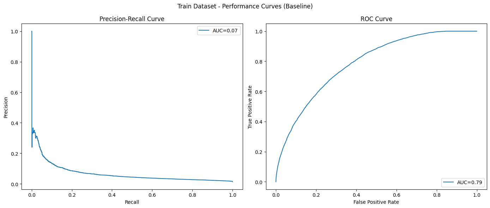
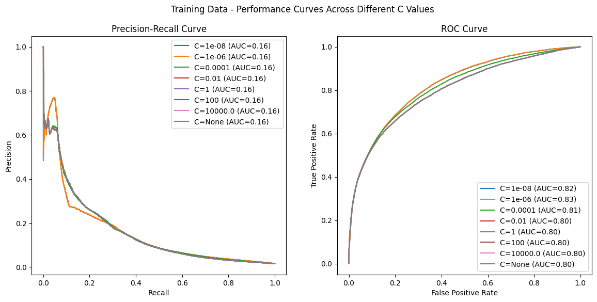
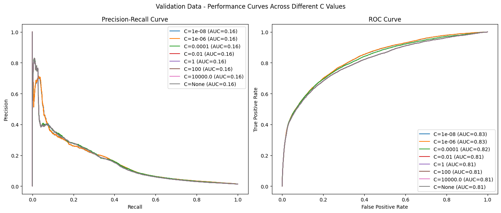

# Milestone 1: Exploration Phase


```python
import pandas as pd
from matplotlib import pyplot as plt
from sklearn.linear_model import LogisticRegression
from sklearn.metrics import precision_recall_curve, auc, roc_curve
from sklearn.preprocessing import StandardScaler
from typing import Any

```


```python
CSV_PATH = "/home/manucorujo/zrive-data/feature_frame.csv"
```


```python
df = pd.read_csv(CSV_PATH)
```


```python
df.head()
```


<div>
<style scoped>
    .dataframe tbody tr th:only-of-type {
        vertical-align: middle;
    }

    .dataframe tbody tr th {
        vertical-align: top;
    }

    .dataframe thead th {
        text-align: right;
    }
</style>
<table border="1" class="dataframe">
  <thead>
    <tr style="text-align: right;">
      <th></th>
      <th>variant_id</th>
      <th>product_type</th>
      <th>order_id</th>
      <th>user_id</th>
      <th>created_at</th>
      <th>order_date</th>
      <th>user_order_seq</th>
      <th>outcome</th>
      <th>ordered_before</th>
      <th>abandoned_before</th>
      <th>...</th>
      <th>count_children</th>
      <th>count_babies</th>
      <th>count_pets</th>
      <th>people_ex_baby</th>
      <th>days_since_purchase_variant_id</th>
      <th>avg_days_to_buy_variant_id</th>
      <th>std_days_to_buy_variant_id</th>
      <th>days_since_purchase_product_type</th>
      <th>avg_days_to_buy_product_type</th>
      <th>std_days_to_buy_product_type</th>
    </tr>
  </thead>
  <tbody>
    <tr>
      <th>0</th>
      <td>33826472919172</td>
      <td>ricepastapulses</td>
      <td>2807985930372</td>
      <td>3482464092292</td>
      <td>2020-10-05 16:46:19</td>
      <td>2020-10-05 00:00:00</td>
      <td>3</td>
      <td>0.0</td>
      <td>0.0</td>
      <td>0.0</td>
      <td>...</td>
      <td>0.0</td>
      <td>0.0</td>
      <td>0.0</td>
      <td>2.0</td>
      <td>33.0</td>
      <td>42.0</td>
      <td>31.134053</td>
      <td>30.0</td>
      <td>30.0</td>
      <td>24.27618</td>
    </tr>
    <tr>
      <th>1</th>
      <td>33826472919172</td>
      <td>ricepastapulses</td>
      <td>2808027644036</td>
      <td>3466586718340</td>
      <td>2020-10-05 17:59:51</td>
      <td>2020-10-05 00:00:00</td>
      <td>2</td>
      <td>0.0</td>
      <td>0.0</td>
      <td>0.0</td>
      <td>...</td>
      <td>0.0</td>
      <td>0.0</td>
      <td>0.0</td>
      <td>2.0</td>
      <td>33.0</td>
      <td>42.0</td>
      <td>31.134053</td>
      <td>30.0</td>
      <td>30.0</td>
      <td>24.27618</td>
    </tr>
    <tr>
      <th>2</th>
      <td>33826472919172</td>
      <td>ricepastapulses</td>
      <td>2808099078276</td>
      <td>3481384026244</td>
      <td>2020-10-05 20:08:53</td>
      <td>2020-10-05 00:00:00</td>
      <td>4</td>
      <td>0.0</td>
      <td>0.0</td>
      <td>0.0</td>
      <td>...</td>
      <td>0.0</td>
      <td>0.0</td>
      <td>0.0</td>
      <td>2.0</td>
      <td>33.0</td>
      <td>42.0</td>
      <td>31.134053</td>
      <td>30.0</td>
      <td>30.0</td>
      <td>24.27618</td>
    </tr>
    <tr>
      <th>3</th>
      <td>33826472919172</td>
      <td>ricepastapulses</td>
      <td>2808393957508</td>
      <td>3291363377284</td>
      <td>2020-10-06 08:57:59</td>
      <td>2020-10-06 00:00:00</td>
      <td>2</td>
      <td>0.0</td>
      <td>0.0</td>
      <td>0.0</td>
      <td>...</td>
      <td>0.0</td>
      <td>0.0</td>
      <td>0.0</td>
      <td>2.0</td>
      <td>33.0</td>
      <td>42.0</td>
      <td>31.134053</td>
      <td>30.0</td>
      <td>30.0</td>
      <td>24.27618</td>
    </tr>
    <tr>
      <th>4</th>
      <td>33826472919172</td>
      <td>ricepastapulses</td>
      <td>2808429314180</td>
      <td>3537167515780</td>
      <td>2020-10-06 10:37:05</td>
      <td>2020-10-06 00:00:00</td>
      <td>3</td>
      <td>0.0</td>
      <td>0.0</td>
      <td>0.0</td>
      <td>...</td>
      <td>0.0</td>
      <td>0.0</td>
      <td>0.0</td>
      <td>2.0</td>
      <td>33.0</td>
      <td>42.0</td>
      <td>31.134053</td>
      <td>30.0</td>
      <td>30.0</td>
      <td>24.27618</td>
    </tr>
  </tbody>
</table>
<p>5 rows × 27 columns</p>
</div>


```python
df.info()
```

    <class 'pandas.core.frame.DataFrame'>
    RangeIndex: 2880549 entries, 0 to 2880548
    Data columns (total 27 columns):
     #   Column                            Dtype  
    ---  ------                            -----  
     0   variant_id                        int64  
     1   product_type                      object 
     2   order_id                          int64  
     3   user_id                           int64  
     4   created_at                        object 
     5   order_date                        object 
     6   user_order_seq                    int64  
     7   outcome                           float64
     8   ordered_before                    float64
     9   abandoned_before                  float64
     10  active_snoozed                    float64
     11  set_as_regular                    float64
     12  normalised_price                  float64
     13  discount_pct                      float64
     14  vendor                            object 
     15  global_popularity                 float64
     16  count_adults                      float64
     17  count_children                    float64
     18  count_babies                      float64
     19  count_pets                        float64
     20  people_ex_baby                    float64
     21  days_since_purchase_variant_id    float64
     22  avg_days_to_buy_variant_id        float64
     23  std_days_to_buy_variant_id        float64
     24  days_since_purchase_product_type  float64
     25  avg_days_to_buy_product_type      float64
     26  std_days_to_buy_product_type      float64
    dtypes: float64(19), int64(4), object(4)
    memory usage: 593.4+ MB


```python
information_cols = ['variant_id', 'order_id', 'user_id', 'created_at', 'order_date']
target_col = 'outcome'
feature_cols = [col for col in df.columns if col not in information_cols + [target_col]]

categorical_cols = ['product_type', 'vendor']
binary_cols = ['ordered_before', 'abandoned_before', 'active_snoozed', 'set_as_regular']
numerical_cols = [col for col in feature_cols if col not in categorical_cols + binary_cols]
```

## 1st task: filter the data to only those orders with 5 items or more to build a dataset to work with.


```python
# Sum outcome (A product is in the order if its outcome is 1)
count_products = df.groupby("order_id").outcome.sum().reset_index()
count_products.head()
```


<div>
<style scoped>
    .dataframe tbody tr th:only-of-type {
        vertical-align: middle;
    }

    .dataframe tbody tr th {
        vertical-align: top;
    }

    .dataframe thead th {
        text-align: right;
    }
</style>
<table border="1" class="dataframe">
  <thead>
    <tr style="text-align: right;">
      <th></th>
      <th>order_id</th>
      <th>outcome</th>
    </tr>
  </thead>
  <tbody>
    <tr>
      <th>0</th>
      <td>2807985930372</td>
      <td>9.0</td>
    </tr>
    <tr>
      <th>1</th>
      <td>2808027644036</td>
      <td>6.0</td>
    </tr>
    <tr>
      <th>2</th>
      <td>2808099078276</td>
      <td>9.0</td>
    </tr>
    <tr>
      <th>3</th>
      <td>2808393957508</td>
      <td>13.0</td>
    </tr>
    <tr>
      <th>4</th>
      <td>2808429314180</td>
      <td>3.0</td>
    </tr>
  </tbody>
</table>
</div>


```python
filtered_orders = count_products[count_products.outcome >= 5]
```


```python
filtered_df = df[df['order_id'].isin(filtered_orders['order_id'])]
filtered_df.info()
```

    <class 'pandas.core.frame.DataFrame'>
    Index: 2163953 entries, 0 to 2880547
    Data columns (total 27 columns):
     #   Column                            Dtype  
    ---  ------                            -----  
     0   variant_id                        int64  
     1   product_type                      object 
     2   order_id                          int64  
     3   user_id                           int64  
     4   created_at                        object 
     5   order_date                        object 
     6   user_order_seq                    int64  
     7   outcome                           float64
     8   ordered_before                    float64
     9   abandoned_before                  float64
     10  active_snoozed                    float64
     11  set_as_regular                    float64
     12  normalised_price                  float64
     13  discount_pct                      float64
     14  vendor                            object 
     15  global_popularity                 float64
     16  count_adults                      float64
     17  count_children                    float64
     18  count_babies                      float64
     19  count_pets                        float64
     20  people_ex_baby                    float64
     21  days_since_purchase_variant_id    float64
     22  avg_days_to_buy_variant_id        float64
     23  std_days_to_buy_variant_id        float64
     24  days_since_purchase_product_type  float64
     25  avg_days_to_buy_product_type      float64
     26  std_days_to_buy_product_type      float64
    dtypes: float64(19), int64(4), object(4)
    memory usage: 462.3+ MB


## 2nd task: Split data into training, validation and test


```python
filtered_df.shape
```


    (2163953, 27)


```python
filtered_df.groupby('order_id').outcome.sum().reset_index().shape
```


    (2603, 2)


There are 2163953 products spread over 2603 orders. In my opinion, a good approach could be a temporary-based split (in order to prevent from infomation leakage), using a typical 70/20/10 distribution.


```python
# Get how many orders are performed each day
daily_orders = filtered_df.groupby('order_date').order_id.nunique()
daily_orders.head()
```


    order_date
    2020-10-05 00:00:00     3
    2020-10-06 00:00:00     7
    2020-10-07 00:00:00     6
    2020-10-08 00:00:00    12
    2020-10-09 00:00:00     4
    Name: order_id, dtype: int64


```python
total_orders = daily_orders.sum()
percentage_orders = pd.DataFrame(columns=['date', 'percentage'])
rows = []
number_orders = 0
for _, row in daily_orders.reset_index().iterrows():
    date = row.iloc[0]
    number_orders += row.iloc[1]
    rows.append(
        {'date': date, 'percentage': number_orders / total_orders}
    )
percentage_orders = pd.DataFrame(rows)

print(percentage_orders.head())

train_val_cut = percentage_orders[percentage_orders.percentage <= 0.7].iloc[-1]
val_test_cut = percentage_orders[percentage_orders.percentage <= 0.9].iloc[-1]

print(f"Train set from: {daily_orders.index.min()}")
print(f"Train set to: {train_val_cut.date}")
print(f"Validation set from: {train_val_cut.date}")
print(f"Validation set to: {val_test_cut.date}")
print(f"Test set from: {val_test_cut.date}")
print(f"Test set to: {daily_orders.index.max()}")

```

                      date  percentage
    0  2020-10-05 00:00:00    0.001153
    1  2020-10-06 00:00:00    0.003842
    2  2020-10-07 00:00:00    0.006147
    3  2020-10-08 00:00:00    0.010757
    4  2020-10-09 00:00:00    0.012294
    Train set from: 2020-10-05 00:00:00
    Train set to: 2021-02-04 00:00:00
    Validation set from: 2021-02-04 00:00:00
    Validation set to: 2021-02-22 00:00:00
    Test set from: 2021-02-22 00:00:00
    Test set to: 2021-03-03 00:00:00


With the dates to split the data selected, is time to create the actual datasets


```python
train_set = filtered_df[filtered_df.order_date <= train_val_cut.date]
val_set = filtered_df[(filtered_df.order_date > train_val_cut.date) & (filtered_df.order_date <= val_test_cut.date)]
test_set = filtered_df[filtered_df.order_date > val_test_cut.date]
```

Divide dataset into features and target


```python
x_train = train_set[feature_cols]
y_train = train_set[target_col]

x_val = val_set[feature_cols]
y_val = val_set[target_col]

x_test = test_set[feature_cols]
y_test = test_set[target_col]
```

## 3rd task: Implement function to plot both precision-recall graph and ROC curve


```python
def plot_curves(ax: Any, y_true: pd.Dataframe, y_pred: pd.Dataframe, label: str=None, curve_type: str="both"):
    if curve_type in ["precision-recall", "both"]:
        precision, recall, _ = precision_recall_curve(y_true, y_pred)
        pr_auc = auc(recall, precision)
        
        ax[0].step(recall, precision, label=f'{label} (AUC={pr_auc:.2f})' if label else f'AUC={pr_auc:.2f}')
        ax[0].set_xlabel('Recall')
        ax[0].set_ylabel('Precision')
        ax[0].set_title('Precision-Recall Curve')

    if curve_type in ["roc", "both"]:
        fpr, tpr, _ = roc_curve(y_true, y_pred)
        roc_auc = auc(fpr, tpr)
        
        ax[1].plot(fpr, tpr, label=f'{label} (AUC={roc_auc:.2f})' if label else f'AUC={roc_auc:.2f}')
        ax[1].set_xlabel('False Positive Rate')
        ax[1].set_ylabel('True Positive Rate')
        ax[1].set_title('ROC Curve')

```

## 4rd task: Define a baseline

In order to have something with which compare our model, we need a baseline. Sometimes it could be given by a business metric or a previous metric. Due to in this we do not have anything of that, we need to define one. I will simply use the 'global_popularity' feature as it. This means that the product will be predicted to be bought the more popular it is.


```python
y_pred = val_set['global_popularity']
y_true = val_set['outcome']

fig, ax = plt.subplots(1, 2, figsize=(14, 6))
fig.suptitle(f"Train Dataset - Performance Curves (Baseline)")

plot_curves(ax, y_true, y_pred, curve_type="both")

ax[0].legend(loc='upper right')
ax[1].legend(loc='lower right')
ax[0].legend(loc='upper right')
ax[1].legend(loc='lower right')

plt.tight_layout()
fig.show()

```

    /tmp/ipykernel_1638/3314613440.py:15: UserWarning: FigureCanvasAgg is non-interactive, and thus cannot be shown
      fig.show()


    

    


## 5th task: Train and evaluate a first model

I will start using a model with just numeric and binary variables, as they don't need preprocessing. Then, I can compare it with models that include all the variables. Due to the problem is a binary classification I will use Logistic Regression (lineal model)


```python
train_cols = numerical_cols + binary_cols
```


```python
# First, standardize the data
scaler = StandardScaler()

x_train_scaled = scaler.fit_transform(x_train[train_cols])
x_val_scaled = scaler.transform(x_val[train_cols])

```

### 5.1 Ridge


```python
fig_train, ax_train = plt.subplots(1, 2, figsize=(14, 6))
fig_train.suptitle('Training Data - Performance Curves Across Different C Values')
fig_val, ax_val = plt.subplots(1, 2, figsize=(14, 6))
fig_val.suptitle('Validation Data - Performance Curves Across Different C Values')

# Define hyperparameter for the level of regularisation
cs = [1e-8, 1e-6, 1e-4, 1e-2, 1, 100, 1e4, None]

for c in cs:
    if c == None:
        lr = LogisticRegression(penalty = None)
    else:
        lr = LogisticRegression(penalty='l2', C=c)
    
    lr.fit(x_train_scaled, y_train)

    train_proba = lr.predict_proba(x_train_scaled)[:, 1]
    plot_curves(ax_train, y_train, train_proba, curve_type="both", label=f'C={c}')

    val_proba = lr.predict_proba(x_val_scaled)[:, 1]
    plot_curves(ax_val, y_val, val_proba, curve_type="both", label=f'C={c}')

ax_train[0].legend(loc='upper right')
ax_train[1].legend(loc='lower right')
ax_val[0].legend(loc='upper right')
ax_val[1].legend(loc='lower right')

plt.tight_layout()
fig_train.show()
fig_val.show()
```

    /tmp/ipykernel_1638/3663856880.py:29: UserWarning: FigureCanvasAgg is non-interactive, and thus cannot be shown
      fig_train.show()
    /tmp/ipykernel_1638/3663856880.py:30: UserWarning: FigureCanvasAgg is non-interactive, and thus cannot be shown
      fig_val.show()


    

    


    

    


### 5.2 Lasso
